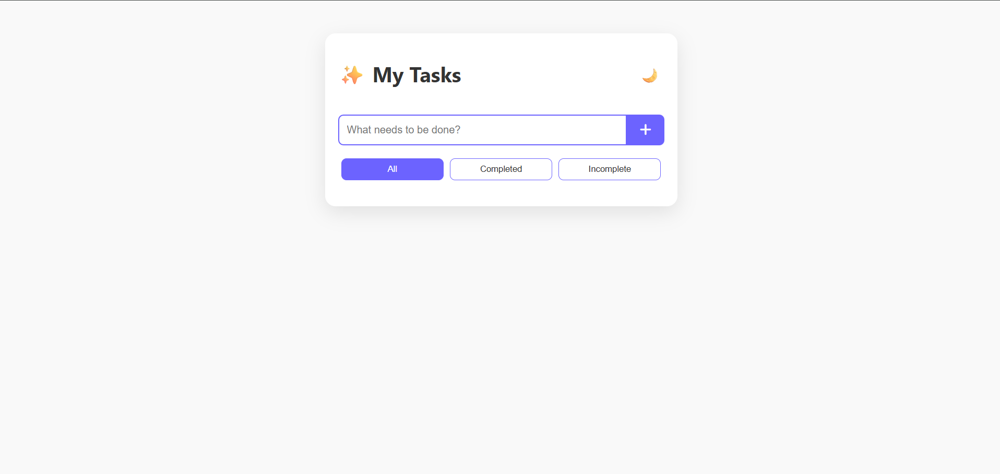
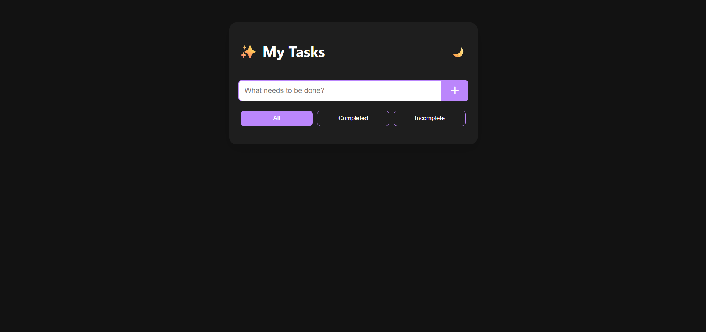

# 🌟 To-Do List App

A beautifully animated and fully functional To-Do List App built using **HTML**, **CSS**, and **JavaScript** — no frameworks involved.
---


---

## ✨ Features

- ✅ Add, complete, and delete tasks
- 🌙 Toggle Dark Mode (with persistence)
- 🔍 Filter by :- All | Completed | Incomplete
- 💾 Local Storage for persistent tasks
- 🎨 Smooth animations & unique UI
- 🧠 100% DOM Manipulation

---

## 🚀 Live Demo

👉 [Click here to try it out](https://devforgeindia.github.io/todo-list-app/)  
👉 [Watch the YouTube Tutorial](https://youtu.be/dxO0nWQk6dI)

---

## 📁 Project Structure
```
📦 to-do-list-app/
├── index.html
├── style.css
└── script.js
```

---

## 🧠 Concepts Covered

- DOM Manipulation
- Event Handling
- localStorage
- Dynamic UI Updates
- CSS Animations
- Dark Mode Toggle

---

## 🛠️ Installation

```bash
git clone https://github.com/DevForgeIndia/todo-list-app.git
cd todo-list-app
open index.html
```

---

## 💡 Bonus Challenge
Try adding:

- ⏰ Due dates
- 🗂️ Task categories

---

## 🙌 Support

If you like this project, consider ⭐ starring the repo and subscribing on YouTube!

---

## 📬 Connect With Me

Made with 💖 by [DevForge India](https://www.youtube.com/@DevForge-India)
